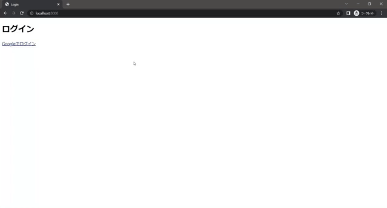

# google-auth-springboot

## Spring bootによるOAuth2.0認証(Google)サンプルコード
前提の知識と経験 
・Spring bootを理解している 
・Spring Securityの多少の理解(Spring Securityの説明はありません)

注意 
Google Cloud PlatformのOAuthクライアントIDが必要となります。下記の動画を参照してください。 
[Spring Cloud Security | OAuth2 Google Sign In using Spring Boot | JavaTechie](https://www.youtube.com/watch?v=qcz2jBLNOtc)

## 実装例

